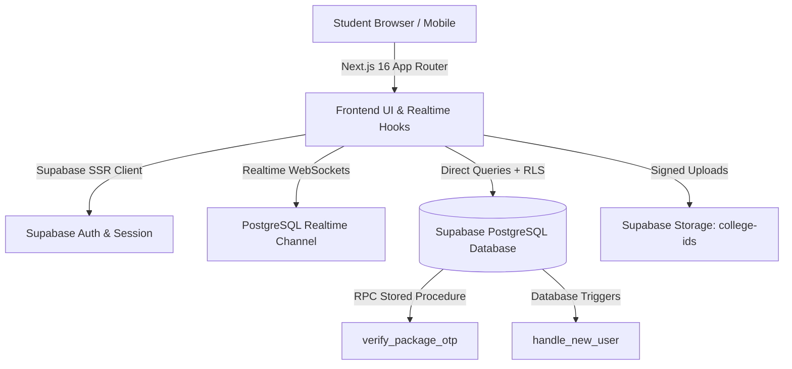

<div align="center">

# 📦 UniFetch
### The Student-Powered Peer Parcel Network for College Campuses
Open **[http://localhost:3000](https://unifetch.netlify.app/)** in your browser!

[](https://nextjs.org/)
[](https://react.dev/)
[](https://supabase.com/)
[](https://tailwindcss.com/)
[](https://www.typescriptlang.org/)

<br />

**Never make the exhausting 20-minute walk to the campus main gate alone again.**

UniFetch connects students waiting for packages at campus security gates with peers who are already heading in that direction. Fast, peer-to-peer delivery with zero courier hassles, secured by a tamper-proof 6-digit OTP handshake.

[🌐 Explore Repository](https://github.com/Abhishek-singh06/unifetch) • [🚀 Quick Start](#-quick-start) • [📐 Architecture](#-how-its-made--tech-stack) • [🛡️ Security & OTP](#-security--the-otp-handshake)

---

</div>

## 💡 What is UniFetch?

In most university campuses, commercial delivery drivers (Amazon, Flipkart, Swiggy, Zomato, Blinkit) are barred from entering past the main security gate or turnstiles.

### The Problem:
- **Disrupted Lectures**: Delivery drivers call repeatedly while students are in class or lab.
- **Exhausting Walks**: Students waste 20–30 minutes walking 1.5+ km in scorching heat or rain just to retrieve small packages.
- **Misplaced Deliveries**: Parcels pile up haphazardly at security guard desks.

### The UniFetch Solution:
UniFetch creates a **hyperlocal student errand economy**:
1. **Request**: A student creates a request specifying their gate parcel and destination hostel/room.
2. **Match**: A fellow student already near the gate claims the delivery with zero detour.
3. **OTP Handshake**: The carrier brings the parcel to the hostel lobby. The requester verifies the package condition and shares their unique 6-digit OTP to complete the transaction and transfer credits.

---

## ✨ Key Features

- **🎨 Human-Crafted Campus Aesthetic**: High-energy, editorial design system featuring `Plus Jakarta Sans` & `Space Grotesk` fonts, warm oat canvas, interactive savings calculator, and live activity tickers.
- **📦 Smart Request Form**: Visual category selectors (Amazon, Food Delivery, Documents/Prints, Blinkit) with gate/hostel presets and room number inputs.
- **🚴 Carrier Command Center (`/carry`)**: Search and filter by gate, view time-remaining countdowns, and earn `+35 Credits 🪙` per delivery run.
- **📊 Real-time Order Dashboard (`/requests`)**: Active delivery progress tracker (*Published ➔ Claimed ➔ Delivered*) with 1-click OTP copy functionality and Supabase Realtime subscriptions.
- **🛡️ Tamper-Proof 6-Digit OTP**: Carriers cannot mark a parcel delivered without the requester's unique cryptographic code.
- **🪪 Strict ID Verification (`/verification`)**: Drag-and-drop ID upload dropzone with instant image preview.
- **👑 Admin Review Console (`/admin/verification`)**: Review pipeline with 10-minute temporary signed URLs for inspecting submitted ID cards.

---

## 🛠️ How It's Made & Tech Stack

UniFetch is built with a modern, resilient full-stack architecture designed for real-time responsiveness and strict campus security.



### 1. Frontend & UI
- **Framework**: [Next.js 16](https://nextjs.org/) (App Router, Turbopack, React 19)
- **Styling**: [Tailwind CSS v4](https://tailwindcss.com/) with custom micro-textures, glassmorphism, and responsive layouts.
- **Typography**: `@import url` for Google Fonts (`Plus Jakarta Sans` + `Space Grotesk`).
- **Icons**: Custom accessible SVGs with semantic labels.

### 2. Backend & Database
- **Backend as a Service**: [Supabase](https://supabase.com/)
- **Database**: PostgreSQL with Row-Level Security (RLS) enabled on all tables.
- **Security & Authorization**:
  - PostgreSQL trigger `on_auth_user_created` automatically initializes student profiles upon signup.
  - Custom `SECURITY DEFINER` function `is_admin()` prevents RLS recursion.
  - Stored Procedure `verify_package_otp(p_request_id, p_otp)` cryptographically validates OTP match and executes atomic status changes.
- **Storage**: Private `college-ids` bucket with restrictive RLS policies and time-limited signed URLs for admin verification.

---

## 🗄️ Database Schema

### `public.profiles`
| Column | Type | Description |
| :--- | :--- | :--- |
| `id` | `UUID (PK)` | References `auth.users.id` (ON DELETE CASCADE) |
| `full_name` | `TEXT` | Student's full name |
| `college` | `TEXT` | College / University name |
| `college_id_url` | `TEXT` | File path in `college-ids` bucket |
| `verification_status` | `TEXT` | `'pending'` \| `'verified'` \| `'rejected'` |
| `role` | `TEXT` | `'student'` \| `'admin'` |
| `credits` | `INTEGER` | User's credit balance (Defaults to 100) |
| `created_at` | `TIMESTAMPTZ` | Timestamp of registration |

### `public.package_requests`
| Column | Type | Description |
| :--- | :--- | :--- |
| `id` | `UUID (PK)` | Unique request identifier (`gen_random_uuid()`) |
| `requester_id` | `UUID (FK)` | References `profiles.id` |
| `carrier_id` | `UUID (FK)` | References `profiles.id` (Assigned carrier) |
| `package_description` | `TEXT` | Description of the package |
| `pickup_location` | `TEXT` | Campus gate / security desk |
| `delivery_location` | `TEXT` | Dropoff hostel & room |
| `pickup_time` | `TIMESTAMPTZ` | Deadline / expected pickup time |
| `pickup_otp` | `VARCHAR(6)` | Private 6-digit delivery confirmation code |
| `status` | `TEXT` | `'pending'` \| `'matched'` \| `'delivered'` \| `'canceled'` |
| `otp_verified` | `BOOLEAN` | Whether OTP handshake succeeded |
| `delivered_at` | `TIMESTAMPTZ` | Timestamp when OTP was confirmed |

---

## 🔒 Security & The OTP Handshake

```
[Requester Creates Order] ───> Generates Private 6-digit OTP (e.g. 482910)
                                      │
[Carrier Claims & Brings Parcel] ─────┤
                                      ▼
[Carrier Meets Requester] ────> Requester inspects parcel & gives OTP verbally
                                      │
[Carrier Submits OTP] ────────> Supabase executes verify_package_otp()
                                      │
                              ✅ OTP Matches?
                             /              \
                          YES                NO
                          /                    \
            [Status: 'delivered']       [Error: 'Invalid OTP']
            [+35 Credits to Carrier]    [No state change]
```

---

## 🚀 Quick Start

### 1. Clone the repository
```bash
git clone https://github.com/Abhishek-singh06/unifetch.git
cd unifetch
```

### 2. Install dependencies
```bash
npm install
```

### 3. Configure environment variables
Create a `.env.local` file in the root directory:
```env
NEXT_PUBLIC_SUPABASE_URL=https://your-project.supabase.co
NEXT_PUBLIC_SUPABASE_PUBLISHABLE_KEY=your-publishable-anon-key
```

### 4. Run the database migration
Open the **[Supabase SQL Editor](https://supabase.com/dashboard)** and run the contents of [`supabase_schema.sql`](./supabase_schema.sql).

### 5. Start the development server
```bash
npm run dev
```


---

## 👥 Contributing

Contributions, issues, and feature requests are welcome! Feel free to check the [issues page](https://github.com/Abhishek-singh06/unifetch/issues).

---

<div align="center">

Made with ❤️ for college campuses everywhere.  
**UniFetch — Packages move better together.**

</div>

